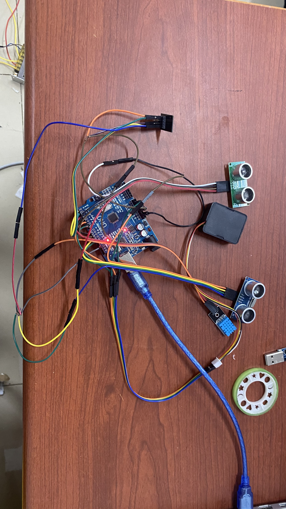

帮机电系做的 快递接收站

温湿度传感器：                     out->2                             VCC->3v    GND->GND
TTS语音模块  软串口：          红色（VCC）：5V
		            黑色（GND）
		            白色：5
                                            黄色：6
超声波 检测人（绿色）：   Trig->8      Echo->9           VCC->5V     GND->GND
超声波 检测物（蓝色）:         Trig->10    Echo->11        VCC->5V      GND->GND
ESP8266WIFI模块：              3V3->3.3V
		             RX->TX
		             EN->3.3V
		             TX->RX
		             GND->GND

WIFI模块连接的WIFI名称：jidian
                        WIFI密码：12345678

arduino_uno文件夹：arduino uno的烧录程序
                        烧录时arduino软件里的工具开发板选择Arduino/Genuino uno，选择端口

esp_01s文件夹：esp8266的烧录程序（烧录时需要USB转TTL）
                烧录时arduino软件里的工具开发板选择Gerenic ESP8266 Module，选择端口

